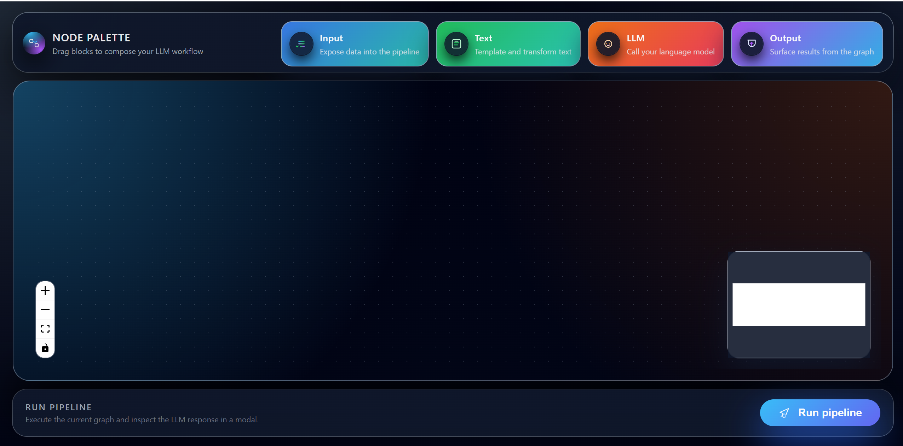
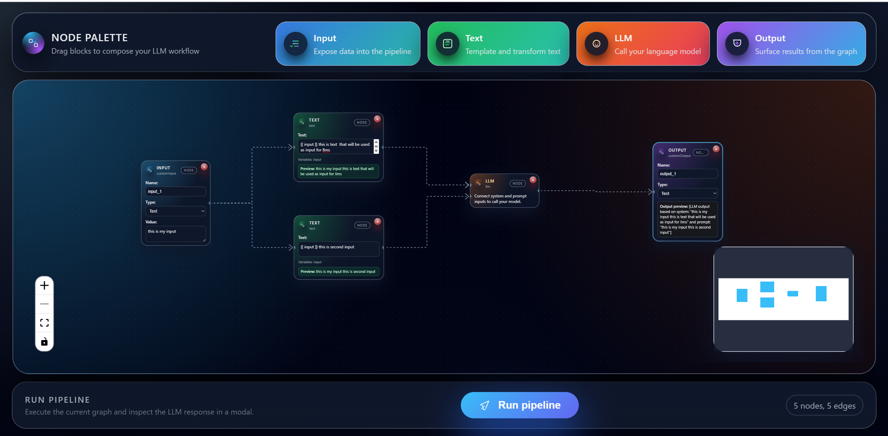
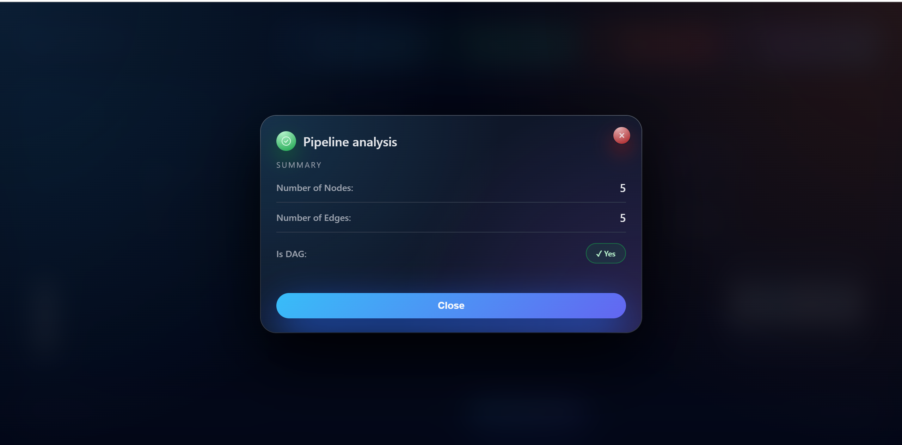

# Visual LLM Pipeline Builder

This project is a **visual workflow builder for LLM-style pipelines**, inspired by tools like VectorShift and LangFlow.

The idea is simple:  
I wanted to let users **visually design a pipeline** by dragging nodes, connecting them, and running the pipeline to understand how data flows — while also validating the structure on the backend.

---

## What this assignment is about

This project is split into two main parts:

- **Frontend**
  - A clean, modern React interface
  - Users visually build a pipeline by dragging and connecting nodes
  - Live previews show what data is flowing through the pipeline

- **Backend**
  - A small FastAPI service
  - Analyzes the pipeline graph sent from the frontend
  - Returns:
    - Number of nodes
    - Number of edges
    - Whether the graph is a valid **Directed Acyclic Graph (DAG)**

### Core concepts

- Each block (**Input**, **Text**, **LLM**, **Output**, etc.) is a **node**
- Connections between blocks are **directed edges**
- Data flows **left → right**
- The user builds the pipeline visually and clicks **Run pipeline** to validate it

---

## High-level flowchart

### System diagrams

These images are rendered directly from the `docs/` folder:







---
### End-to-end flow (box diagram)

### 2.2 flowchart
```
+---------------------------------------------------+
|                    USER                           |
| - drags nodes (Input/Text/LLM/Output)             |
| - connects edges                                  |
| - clicks "Run pipeline"                           |
+---------------------------------------------------+
                          |
                          v
+---------------------------------------------------+
|     FRONTEND (React + React Flow + Zustand)       |
|                                                   |
|  [Toolbar]  -> shows draggable node types         |
|  [Canvas]   -> ReactFlow graph (nodes + edges)    |
|  [Runtime]  -> pipelineRuntime.js                 |
|                - computes live previews           |
|  [Button]   -> SubmitButton                       |
|                - serializes graph to JSON         |
|                - wraps it in FormData("pipeline") |
+---------------------------------------------------+
                          |
        HTTP POST /pipelines/parse (FormData)       |
                          v
+---------------------------------------------------+
|           BACKEND (FastAPI + Python)              |
|                                                   |
|  /pipelines/parse:                                |
|    - parse JSON graph                             |
|    - count num_nodes & num_edges                  |
|    - run is_dag(nodes, edges) using               |
|      Kahn's algorithm (topological sort)          |
|    - build JSON summary                           |
+---------------------------------------------------+
                          |
               JSON { num_nodes, num_edges, is_dag }|
                          v
+---------------------------------------------------+
|    FRONTEND (ResponseModal + UI feedback)         |
|                                                   |
|  - shows error message (if any)                   |
|  - OR shows:                                      |
|      * number of nodes                            |
|      * number of edges                            |
|      * DAG status (Yes / No)                      |
+---------------------------------------------------+
```

---

## Demo video

Below is a demo showing the full flow — from building a pipeline to running it and viewing the result.

<video width="720" controls>
  <source src="https://drive.google.com/uc?export=download&id=1JQUiFxsCfE4ZtFij4qD2iix0ncTRhVFI" type="video/mp4">
  Your browser does not support the video tag.
</video>

🔗 **Direct link:**  
https://drive.google.com/file/d/1JQUiFxsCfE4ZtFij4qD2iix0ncTRhVFI/view

---

## How the system works (in words)

- The user builds the pipeline in the **frontend**
- The frontend computes **live previews** of node values
- When the user clicks **Run pipeline**, the graph is sent to the backend
- The backend analyzes the structure and returns a summary
- The frontend displays the result in a modal

---

## 3. References 

- **VectorShift – Frontend Technical Assessment Instructions** (PDF):
  - The file `VectorShift - Frontend Technical Assessment Instructions.pdf` in the repo describes what kind of UI/UX and behaviour is expected.
- **React Flow documentation & examples**:
  - Used to design the drag‑and‑drop node canvas and custom nodes.
- **FastAPI documentation**:
  - Used for building a compact API endpoint with form handling and CORS.
- **Graph theory / Kahn’s algorithm**:
  - Used to implement the DAG check on the backend.

---

## 4. Tech stack 

- **Frontend**
  - React
  - `reactflow` – for the visual graph editor.
  - `zustand` – for storing and updating nodes and edges.
- **Backend**
  - Python 3 with **FastAPI**
  - `uvicorn` – development server.
- **Communication**
  - HTTP `POST` to `http://127.0.0.1:8001/pipelines/parse`.
  - Body is a `FormData` with a single field `pipeline` that contains the JSON graph.

---

## 5. Frontend: how it works, step by step

### 5.1 Building the pipeline

1. **Node palette** (`PipelineToolbar` + `DraggableNode`):
   - At the top, the user sees "chips" for **Input**, **Text**, **LLM**, **Output**.
   - The user drags a chip and drops it into the canvas area.

2. **Canvas & graph state** (`PipelineUI`):
   - The canvas is powered by `ReactFlow`.
   - The list of `nodes` and `edges` lives in a shared `zustand` store.
   - When the user drops a node:
     - The code calculates a position.
     - It generates a new id like `customInput-1`.
     - It creates a new node object in the store.
   - When the user draws a connection between two handles, a new **edge** is added.
   - Pressing **Delete/Backspace** removes selected nodes/edges (with a confirmation popup).

3. **Node components** (`nodes/*` on top of `BaseNode`):
   - All nodes share a common visual style from `BaseNode` (header, icon, delete button, handles, etc.).
   - **InputNode**:
     - The user chooses a name, type, and a value.
     - The value flows out of the output handle into whoever is connected.
   - **TextNode**:
     - The user writes text like `"Hello {{ input }}"`.
     - Every `{{ variable }}` the user writes creates an input handle on the left.
     - The node shows a **Preview** of the final text after substituting the connected values.
   - **LLMNode**:
     - Has `system` and `prompt` inputs and a `response` output.
     - Currently, the frontend uses a **placeholder string** instead of calling a real LLM, but the wiring shows how it would connect.
   - **OutputNode**:
     - Lets the user name and type the final output.
     - Shows an **Output preview**, so the user sees the final value that reaches the output.

4. **Local pipeline evaluation (`pipelineRuntime.js`)**
   - The function `evaluateNodeValue(nodeId, nodes, edges)` walks **backwards** from a node to figure out what value it should have.
   - There is:
     - A **cache** so nodes are not recomputed unnecessarily.
     - A **visiting set** to avoid infinite loops if there is a cycle.
   - Behaviour per node type:
     - Input → returns its stored value.
     - Text → replaces `{{ variable }}` placeholders with values read from incoming connections.
     - Transform → applies small text transforms (uppercase/lowercase/reverse/etc.).
     - LLM → returns a placeholder string based on system + prompt.
     - Output → reads from its single `value` handle.
     - Others → just forward the first incoming value.

### 5.2 Sending the pipeline to the backend

1. **User clicks “Run pipeline”** (`SubmitButton`):
   - If there are **no nodes**, it immediately shows an error message in the modal.
2. **Serialize the graph**:
   - Takes all `nodes` and `edges` from the store.
   - Creates a clean JSON object:
     - Nodes: `{ id, type, position, data }`
     - Edges: `{ id, source, target, sourceHandle, targetHandle }`
3. **Build the request**:
   - Wraps that JSON string in a `FormData` field called `pipeline`.
   - Sends a `POST` to `http://127.0.0.1:8001/pipelines/parse`.
4. **Handle the response**:
   - On error HTTP status:
     - Reads `{ error: "..." }` from the body if present and shows it.
   - On success:
     - Expects `{ num_nodes, num_edges, is_dag }`.
     - Stores it in local state and opens the modal.
5. **Show the result** (`ResponseModal`):
   - In **success mode**:
     - Displays number of nodes and edges.
     - Shows a badge that says whether the graph **is** or **is not** a DAG.
   - In **error mode**:
     - Displays a styled error message (including hints to check if the backend is running).

---

## 6. Backend: how it works, step by step

All code is in `backend/main.py`.

1. **Setup**:
   - Create a `FastAPI()` app.
   - Add `CORSMiddleware` so the React app at `localhost:3000` or `127.0.0.1:3000` can talk to it.

2. **Health route**:
   - `GET /` → returns `{ "Ping": "Pong" }`.

3. **DAG checker – `is_dag(nodes, edges)`**:
   - Extract all node ids.
   - Build:
     - An adjacency list of edges (who points to whom).
     - An `in_degree` map counting how many incoming edges each node has.
   - Run **Kahn’s algorithm**:
     - Put all nodes with `in_degree == 0` into a queue.
     - Repeatedly remove from the queue and decrease the `in_degree` of neighbours.
     - Track how many nodes are processed.
   - If all nodes are processed → **no cycles → DAG**.
   - If fewer than all nodes are processed → **there is a cycle somewhere**.

4. **Main endpoint – `POST /pipelines/parse`**:
   - Reads `pipeline` from the form.
   - Parses it as JSON into `pipeline_data`.
   - Pulls out `nodes` and `edges`.
   - Computes:
     - `num_nodes = len(nodes)`
     - `num_edges = len(edges)`
     - `is_dag_result = is_dag(nodes, edges)`
   - Returns:

     ```json
     {
       "num_nodes": <int>,
       "num_edges": <int>,
       "is_dag": <true | false>
     }
     ```

   - If parsing fails, returns `{ "error": "Invalid JSON: ..." }`.
   - Any other unexpected error is also wrapped in an `error` field.

---

## 7. How to run everything locally

### 7.1 Backend (FastAPI)

1. Install dependencies (example):

   ```bash
   pip install fastapi uvicorn
   ```

2. From the project root, run:

   ```bash
   uvicorn backend.main:app --reload --port 8001
   ```

3. Check `http://127.0.0.1:8001/` – the user should see `{ "Ping": "Pong" }`.

### 7.2 Frontend (React)

1. From the project root:

   ```bash
   cd frontend
   ```

2. Install dependencies:

   ```bash
   npm install
   ```

3. Start the dev server:

   ```bash
   npm start
   ```

4. Open `http://localhost:3000` in the browser.
5. Make sure the backend is running on `http://127.0.0.1:8001` so the **Run pipeline** button works.

---

## 8. Design notes (why it looks like this)

- **Visual style**:
  - Dark theme with gradients and soft glows to keep your focus on the graph.
  - Glass‑morphism cards (toolbar, canvas container, footer, modal) to make sections feel layered.
- **Node design**:
  - Common `BaseNode` styling for consistency (same header, delete button, handles layout).
  - Clear left/right handles so it is visually obvious how data flows.
- **UX touches**:
  - Keyboard shortcuts for deletion (Delete/Backspace) plus a visible `×` button.
  - Live previews in Text and Output nodes so the user doesn’t have to guess what values are flowing.
  - The response modal uses colour and animation to clearly communicate success vs error.
